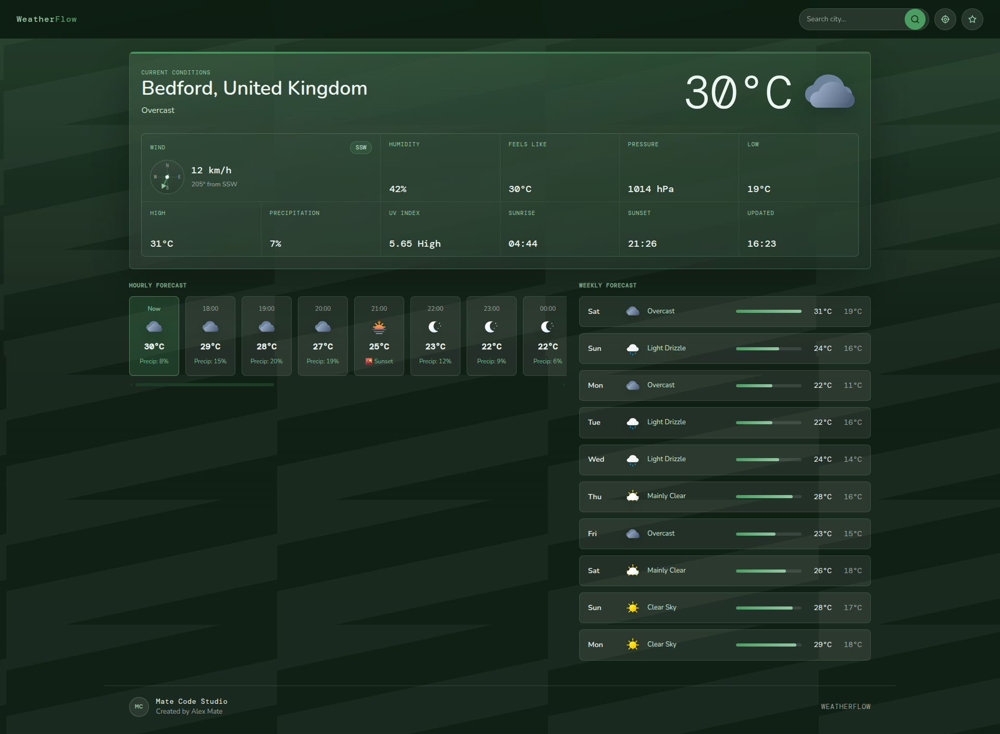

# WeatherFlow

WeatherFlow is a responsive weather dashboard built with HTML, CSS, and JavaScript. It uses the Open-Meteo API to display current weather conditions, hourly forecasts, a 10-day forecast, UV index information, sunrise and sunset times, wind direction, and custom SVG weather icons.

The project started as part of the freeCodeCamp curriculum, but it has been redesigned, expanded, and polished into a portfolio-ready frontend application with geolocation, local storage, animated weather backgrounds, loading and error states, and a custom dark emerald interface.

## Live Demo

[View Live Project](https://alex-mate.github.io/WeatherFlow/)

## Preview



## Features

- Automatically loads weather data based on the user’s current location
- Search weather by city
- Button to switch back to the user’s geolocation after searching another city
- Save favorite locations
- View recent searches
- Display current temperature and weather condition
- Hourly forecast cards
- 10-day forecast section
- Sunrise and sunset times
- UV index with readable risk levels
- Humidity, wind speed, wind direction, pressure, precipitation, high and low temperature, and feels-like temperature
- Wind direction indicator with compass-style UI
- Custom SVG weather icons for Open-Meteo weather codes
- Separate day and night weather icons
- Sunrise and sunset icon logic
- Dynamic icon switching based on the forecast hour
- Animated weather backgrounds based on current conditions
- Loading state while fetching weather data
- Error state for failed searches or unavailable data
- Dark emerald UI theme
- Responsive layout for desktop and mobile screens

## Tech Stack

- HTML5
- CSS3
- JavaScript
- Open-Meteo API
- Browser Geolocation API
- Local Storage
- Custom SVG icons

## API Integration

WeatherFlow uses the Open-Meteo API to fetch weather data based on either the user’s current location or a searched city.

The app uses weather data such as:

- Current temperature
- Weather condition codes
- Hourly forecast
- Daily forecast
- Sunrise and sunset times
- UV index
- Humidity
- Wind speed
- Wind direction
- Air pressure
- Precipitation probability
- High and low temperatures
- Feels-like temperature

Weather codes returned by the API are mapped to readable descriptions and custom SVG icons.

## Location Features

On first load, WeatherFlow uses the browser’s Geolocation API to display weather data for the user’s current location.

Users can search for a different city and then quickly switch back to their current location using the geolocation button. The app also supports favorite locations and recent searches using local storage, making it easier to revisit frequently checked places.

## Custom Weather Icons

WeatherFlow uses a custom SVG icon set for Open-Meteo weather codes.

The icon system includes:

- Day weather icons
- Night weather icons
- Sunrise icon
- Sunset icon
- Icons for clear sky, cloudy conditions, fog, drizzle, rain, freezing rain, snow, showers, thunderstorms, and hail

## Day and Night Icon Logic

One of the main improvements in this project is the custom day and night icon system.

For each hourly forecast card, WeatherFlow compares the forecast hour with the sunrise and sunset time. This allows the app to show daytime icons after sunrise and nighttime icons after sunset.

The app also displays dedicated sunrise and sunset icons when the forecast hour matches those events.

## Wind Direction Indicator

WeatherFlow includes a wind direction indicator that converts wind direction degrees into readable compass directions such as N, NE, E, SE, S, SW, W, and NW.

This makes the weather details section more informative and gives the interface a more complete dashboard-style experience.

## Animated Weather Backgrounds

The interface includes animated weather backgrounds based on the current weather condition.

These background effects help the app feel more dynamic and visually connected to the live weather data without overwhelming the main dashboard.

## User Experience Improvements

WeatherFlow includes loading and error states to make the app feel smoother and more reliable.

When weather data is being fetched, the app displays a loading state. If a city cannot be found or the API request fails, the app shows an error state instead of breaking the interface.

The app also uses local storage for favorite locations and recent searches, improving the experience for repeat use.

## Project Structure

```txt
WeatherFlow/
  assets/
    icons/
      day/
      night/
      sun.svg
      sunrise.svg
      sunset.svg
    images/
      weatherflow-preview.png
  css/
    styles.css
  js/
    api.js
    script.js
    ui.js
    weather-codes.js
    weather-icons-day.js
    weather-icons-night.js
  index.html
  README.md
```

## What I Improved Beyond the Original Project

- Redesigned the UI with a custom dark emerald visual style
- Added a polished dashboard layout
- Added automatic weather loading based on user geolocation
- Added a button to return to the user’s current location
- Added favorite locations
- Added recent searches
- Added loading and error states
- Added animated weather backgrounds based on current conditions
- Added custom SVG icons for weather conditions
- Added separate day and night icon versions
- Added sunrise and sunset icons
- Added logic for switching icons based on sunrise and sunset times
- Added wind direction indicator with compass-style UI
- Improved the hourly forecast section
- Added a 10-day forecast overview
- Added extra weather details such as UV index, pressure, humidity, wind direction, and feels-like temperature
- Improved weather code mapping and data formatting
- Improved the overall project structure for portfolio presentation

## Future Improvements

- Improve mobile responsiveness further
- Add Celsius/Fahrenheit unit toggle
- Add more detailed accessibility improvements
- Add keyboard navigation improvements
- Add better empty states for saved and recent locations
- Add more advanced background animations for severe weather conditions

## Lessons Learned

This project helped me improve my understanding of working with APIs, browser geolocation, local storage, conditional rendering, and user-focused interface states.

I also focused on improving visual design, organizing reusable weather data, handling errors properly, mapping weather codes to custom icons, and turning a course project into a more complete portfolio project.

## Author

Created by Alex Mate
Mate Code Studio

- Portfolio: https://matecodestudio.com
- GitHub: https://github.com/alex-mate
- LinkedIn: https://www.linkedin.com/in/alex-mate
